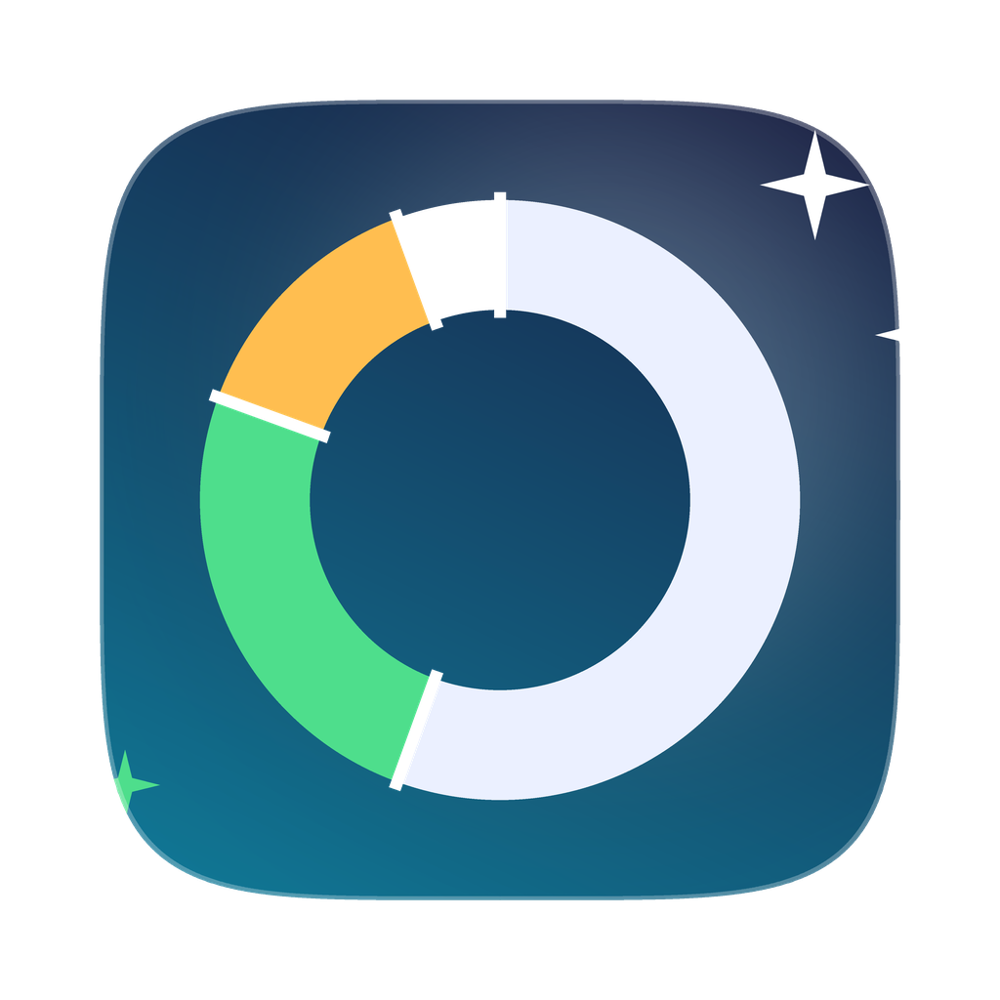

# SpaceSweep

[](https://github.com/SabhyaAggarwal/SpaceSweep/actions/workflows/build.yml)

A native macOS app (SwiftUI, macOS 14+) that finds what is eating your disk — Xcode junk, WhatsApp media, package caches, build folders, old Downloads, duplicates and files you haven't opened in months — and lets you review and remove it with a clear risk label on every row.

No Electron, no subscriptions, no telemetry. One Swift package; build it yourself in about a minute.

<p align="center"></p>

## What it scans

Every category shows size, item count, **last opened**, modified date, kind and a **risk badge**:

| Badge | Meaning |
|---|---|
| ✅ Safe | Regenerated automatically (caches, build products, logs). Pre-selected after a scan. |
| 👁 Review | Your own files. Nothing breaks, but you may want them (Downloads, media, old documents). |
| ⚠️ Careful | Deleting loses data or needs a re-download (iOS backups, simulator runtimes, duplicate "originals"). |

### Developer
| Category | Where | Notes |
|---|---|---|
| Xcode DerivedData | `~/Library/Developer/Xcode/DerivedData` | Per-project build intermediates, often 10–50 GB ([guide](https://dev.to/nixeton/how-to-clean-up-xcode-and-free-30-50gb-on-your-mac-3ogh)) |
| Xcode Archives | `~/Library/Developer/Xcode/Archives` | Grouped by date; keep the ones you still need for crash symbolication |
| Device Support Symbols | `~/Library/Developer/Xcode/iOS DeviceSupport` (+ watchOS/tvOS) | Marks versions for devices you no longer plug in |
| Simulator Devices | `~/Library/Developer/CoreSimulator/Devices` | Lists each device with its size; **Delete Unavailable Simulators** runs `xcrun simctl delete unavailable` |
| Xcode Caches & Previews | `~/Library/Caches/com.apple.dt.Xcode`, `~/Library/Developer/Xcode/DocumentationCache`, Previews | |
| Project Build Folders | Your project roots (Settings → Folders) | Finds `node_modules`, `.build`, `target`, `.venv`, `.pio`, `build`, `dist`, `__pycache__`, `Pods`… |
| Package Manager Caches | Homebrew, npm, pnpm, yarn, bun, pip, uv, Cargo, Gradle, Maven, CocoaPods, Go, Hugging Face, Playwright, Cypress, conda… | **Run brew cleanup** button when Homebrew is installed |
| Embedded & Maker Tools | Arduino staging/tmp, PlatformIO & ESP-IDF caches, KiCad, Bambu Studio / Orca / PrusaSlicer caches & logs, Raspberry Pi Imager, QMK builds | Arduino's `staging` folder can be purged safely ([reference](https://electricalflux.com/mcu-coding/arduino-ide-mac-apple-silicon-optimization)); Bambu Studio caches live in `~/Library/Caches/com.bambulab.bambu-studio` ([forum](https://forum.bambulab.com/t/software-wont-open-2-8-2-61/259238)) |
| Docker & VMs | `Docker.raw`, UTM/Parallels/VirtualBox disk images | Marked Careful — these are your machines |

### Apps & messaging
| Category | Where |
|---|---|
| WhatsApp Media | `~/Library/Group Containers/group.net.whatsapp.WhatsApp.shared/Message/Media` — every photo, video and document ever received ([details](https://everywherefast.com/blog/find-whatsapp-files-mac)) |
| Telegram Cache | `~/Library/Group Containers/6N38VWS5BX.ru.keepcoder.Telegram`, `~/Library/Caches/ru.keepcoder.Telegram` ([details](https://macpaw.com/how-to/clear-telegram-cache)) |
| Slack, Discord, Teams & Zoom | Their `Cache` / `Code Cache` / `GPUCache` folders |
| Spotify, Music & Streaming Caches | Spotify offline cache, Music/TV caches |
| Mail & Messages Attachments | `~/Library/Mail`, `~/Library/Messages/Attachments` (needs Full Disk Access) |
| Leftovers From Deleted Apps | `Application Support`, `Caches`, `Containers` folders whose app is no longer installed |

### System & caches
User Caches · Logs & Crash Reports · iPhone & iPad Backups (`~/Library/Application Support/MobileSync/Backup`) · iOS Software Updates · Trash (with **Empty Trash**) · Other System Junk (Quick Look thumbnails, Saved Application State, VS Code/Cursor/JetBrains caches, Adobe media cache).

### Your files
| Category | How it works |
|---|---|
| Downloads | Every item with size and last-opened date; installers (`.dmg`, `.pkg`, `.zip`) flagged |
| Large Files | Walks `~` for files over the threshold (default 200 MB) |
| Not Opened in a Long Time | Files over 1 MB unopened for N days (default 180) using the file's last-access time, falling back to modification date |
| Duplicate Files | Groups by size, then SHA-256 of a head/tail sample, then full hash; the newest copy is marked Careful so you keep one |
| Screenshots & Screen Recordings | Desktop/Downloads files matching macOS screenshot names |

## Safety model

- **Trash by default.** Removal uses `FileManager.trashItem`, so ⌘Z in Finder still works. A per-action toggle (and a Settings default) switches to permanent deletion.
- **Always confirm.** Every deletion shows the full list with sizes and risk badges before anything moves.
- **Protected roots.** The app refuses to delete `~`, `~/Library`, `~/Documents`, `~/Desktop`, `~/Downloads`, `~/Pictures`, `/Applications`, `/System`, `/Library`, `/usr` etc. as a whole — only specific items from a scan result.
- **Not sandboxed.** It has to read `~/Library`. Grant **Full Disk Access** (System Settings → Privacy & Security) to see Mail, Messages, Safari and iOS backups; the app detects when a folder was denied and shows a banner with a button that deep-links there ([Apple Developer Forums](https://developer.apple.com/forums/thread/114452)).
- **Scans are cancellable** and run off the main thread; the UI stays responsive on a 100k-file walk.

## Build

Requirements: macOS 14 Sonoma or later, Xcode 15+ **or** the Command Line Tools (`xcode-select --install`).

```bash
git clone https://github.com/SabhyaAggarwal/SpaceSweep.git
cd SpaceSweep
./build.sh --install      # builds build/SpaceSweep.app, copies it to /Applications and opens it
```

Other options:

```bash
./build.sh                # just produce build/SpaceSweep.app
./build.sh --run          # build and launch from ./build
swift run                 # quick dev run without an app bundle (no icon, no Dock name)
open Package.swift        # open in Xcode; pick the SpaceSweep scheme and press ⌘R
swift test                # 19 unit tests for the CleanCore engine (also runs on Linux)
```

The first launch may show "SpaceSweep is from an unidentified developer" because the bundle is ad-hoc signed; right-click → Open, or run `xattr -dr com.apple.quarantine build/SpaceSweep.app`.

## Download a prebuilt app

Every push to `main` builds `SpaceSweep.app` on GitHub Actions — grab `SpaceSweep.app.zip` from the latest run under **Actions → Build → Artifacts**. Tagging `v*` publishes it as a GitHub Release. Because it is ad-hoc signed, run `xattr -dr com.apple.quarantine SpaceSweep.app` once after unzipping, or right-click → Open.

## Keyboard shortcuts

| Shortcut | Action |
|---|---|
| ⇧⌘R | Scan everything (including slow deep scans) |
| ⌘. | Stop all scans |
| ⌘⌫ | Move selected rows to Trash (after confirmation) |
| Double-click row | Reveal in Finder |
| ⌘, | Settings (thresholds, project roots, exclusions, deletion default) |

## Project layout

```
Package.swift
Sources/CleanCore/          Engine — no AppKit/SwiftUI, builds on Linux
  Models.swift              FileEntry, ScanResult, ScanSettings, RiskLevel
  Categories.swift          The 26 categories, their paths and risk levels
  FileSystem.swift          Cancellable directory walker, lstat wrapper, size calculator
  Scanners/                 Location, Downloads, Simulator, Trash, LargeFiles, Stale, Duplicates, Leftovers…
  ScanEngine.swift          ScanEngine, DiskUsage, Cleaner (trash / permanent / empty trash)
Sources/SpaceSweep/         SwiftUI app
  AppModel.swift            @Observable state: scans, selection, deletion flow, settings persistence
  Services/MacServices.swift  Finder, icons, Full Disk Access check, shell helpers
  Views/                    ContentView (sidebar), OverviewView, CategoryDetailView (Table), Sheets, SettingsView
Tests/CleanCoreTests/       Engine tests
Resources/                  Info.plist, AppIcon.png
build.sh                    Package into SpaceSweep.app
```

## Adding a category

Append a `CleanCategory` to `Catalog.all` in `Sources/CleanCore/Categories.swift`:

```swift
CleanCategory(
    id: "apps.myapp", title: "MyApp Cache", subtitle: "Thumbnails MyApp re-creates",
    group: .apps, risk: .safe,
    kind: .children(paths: ["~/Library/Caches/com.example.myapp"]),
    symbol: "photo.stack",
    explanation: "Why it's safe and what happens after deleting."
)
```

`kind` picks the scanner: `.whole` (one row per folder), `.children` (one row per sub-item), or one of the special scanners. Categories whose paths don't exist are hidden automatically.

## License

MIT — see [LICENSE](LICENSE).
